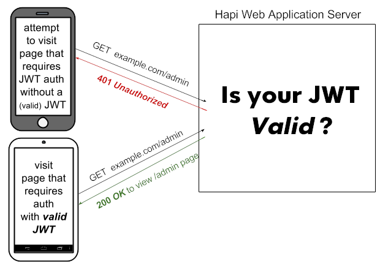
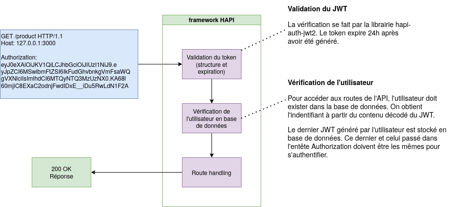

# ProductGuessr

## Description du projet

La SAE S4 s’est déroulée pendant les semaines S12 à S14. L’objectif est de construire une application reposant sur des micro-services, disposant d’un client 
Android natif et d’un client Web. Les données utilisées doivent provenir de plusieurs sources externes, à savoir des API ou fichiers CSV.

Notre application nommée PriceGuessr est inspirée du jeu GuessTheGame disponible sur navigateur et dont le but est de deviner le nom d’un jeu à partir de 
plusieurs images. Nous nous sommes inspirés de ce concept et l’avons transposé aux produits vendus par l’enseigne IKEA. Ainsi, les joueurs sont invités à 
deviner le prix des produits à partir de leur nom et de leur image. Il convient de noter que l’application est alimentée tous les jours avec 10 nouveaux 
produits. De plus, les joueurs n’ont que 5 essais pour trouver le prix du produit et des indications après chacune des tentatives (est-ce que le prix correct 
est supérieur ou inférieur au prix rentré). L’utilisateur a également la possibilité de consulter l’intégralité des produits (titre, description, image, prix, 
disponibilité). Bien entendu, le prix est affiché uniquement lorsque le produit n’est pas dans la liste du jour, ou lorsque l’utilisateur l’a trouvé. Enfin, il 
est possible d’obtenir la disponibilité de ces produits dans les différents magasins IKEA de France et leur localisation.

Pour permettre son bon fonctionnement, l’application dispose d’un système d’authentification incluant, la connexion, l’inscription, la modification de mot de 
passe ainsi que la suppression de compte. INGKA Holding B.V. est un groupe possédant 367 magasins IKEA sur les 422 existants à la date du 5 avril 2023. Nos 
données proviennent directement de l’API Ingka qui met notamment à disposition la liste des magasins, les articles en stock et leurs informations.

## Technologies

Cette API a été créé en NodeJS avec le framework Hapi, ainsi que les librairies joi et hapi-auth-jwt2.

Hapi-auth-jwt2 sert à authentifier les utilisateurs avec des Json Web Token (JWT), qui permettent de signer un jeton que les utilisateurs donnent à chaque 
requête. Une vérification se fait ensuite au niveau du serveur. Cela permet de vérifier l’identité de la personne et qu’elle n’essaie pas de passer pour 
quelqu’un d’autre. La structure du token permet de vérifier que son contenu n’a pas été modifié.

Il convient de noter que le token est renvoyé après l'authentification de l'utilisateur avec la route `/user/auth`. 

Voici un schéma de son fonctionnement:


Ainsi qu'une description plus détaillée:


Deux sources de données sont utilisées:
- Un script Python qui permet de récupérer et traiter nos données depuis Ikea, avec le module ikea-api
- Une api Javascript, qui fonctionne avec Ingka pour obtenir la disponibilité des produits dans les magasins Ikea du monde entier.

Le script Python est exécuté de manière séparée du reste de l'API, et met les données dans un cache d'objets Json. Les produits sont récupérés de ce cache.

Les clients reposent sur des micro-services:
- Client Android natif : kotlin
- Client Web : ReactJS

## Déploiement

Pour cloner ce projet directement avec l'application Android:
```
git clone --recurse-submodules https://gitlab.univ-nantes.fr/sea4-eq_03_01/eq_03_01-App.git
```
Ou, si le projet était déjà cloné de manière normale, pour obtenir l'application Android, exécuter `git submodule update --init --recursive` dans le dossier du git.

Pour mettre à jour le projet à la dernière version:
```
git pull
git submodule update --recursive
```
Il faut installer les dépendances des projets javascript, dans api/ et guessr_web/ avec `npm install`; Pour utiliser le script python, il faut également installer le module nécessaire avec `pip install ikea-api`.

## Utilisation

Pour mettre à jour le cache qui contient les produits Ikea, utiliser le script python `ikea.py` dans ce même dossier:
```
cd api/dao/data/
python3 ikea.py
```

Pour remplir la base de données avec les produits du jour, il faut exécuter le script `api/dao/data/startPopulate.mjs`, qui va prendre 10 produits aléatoires de ce cache:
```
cd api/dao/data/
node startPopulate.mjs
```

Un fichier api/.env est nécessaire au bon fonctionnement du serveur. Ce fichier est fourni dans le git, mais selon le type de machine sur laquelle le serveur sera déployé, il faudra changer l'entrée `USE_IUT_PROXY`.

Si le serveur est déployé sur une machine de l'IUT, utiliser `USE_IUT_PROXY = true`.
Sinon, utiliser `USE_IUT_PROXY = false`.

Pour démarrer le serveur, utiliser la commande `npm start` dans le dossier api/

Puis, pour démarrer le site, utiliser la commande `npm start` dans le dossier guessr_web/.

L'application peut être démarrée depuis Android Studio, à partir du dossier projet `eq_03_01-App`. Les dépendances devraient être automatiquement prises en charge par Gradle.

### Détails site

Après avoir créé un compte et s'être connecté, ou en utilisant un compte existant, le jeu devient accessible.

Il est alors possible d'essayer de deviner le prix d'un produit, changer de produit avec les flèches à la gauche et à la droite du produit, et d'accéder à l'historique des produits passés.

Ceux du jour n'afficheront pas encore leur prix; Pour pouvoir les voir, il faut attendre le landemain, afin d'éviter la triche.

De plus, la page d'un produit comporte également sa disponibilité dans tous les magasins de France; La liste ne peut pas être parcourue avec la molette de la souris, il faut utiliser la scrollbar.

Enfin, un utilisateur peut modifier son mot de passe et supprimer son compte dans la page de compte.

### Détails application

Après avoir créé un compte et s'être connecté, ou en utilisant un compte existant, le jeu devient accessible.

La page principale est la page du jeu; Il devrait normalement y avoir une image du produit, mais l'accès aux images fournies par notre API est impossible dû au proxy de l'IUT. Le jeu peut fonctionner normalement si il est accédé en dehors de ce réseau.

Sur cette page, accessible à tout moment en appuyant sur le bouton de page principale à gauche de la barre de navigation, un utilisateur peut essayer de deviner le prix des produits.

Le bouton du milieu permet d'accéder à l'historique des produits; Le prix pour les produits du jour ne s'affichent que si l'utilisateur les a deviné. Sinon, il doit attendre le landemain.

Enfin, le troisième bouton, à gauche, mène à la page de compte, qui permet à l'utilisateur de changer son mot de passe ou supprimer son compte.

## Tests de l'API

### Informations

Afin de tester notre API, nous avons utilisé chai (pour les assertions de test), mocha (pour créer les cas de test) et nyc (pour le coverage). Nous avons également ajouté les plugins chai-http et chai-as-promised, qui permettent respectivement de tester les routes HTTP et d’effectuer des assertions sur des Promise (promesses) javascript.
De plus, une base de données de test est initialisée en même temps que les tests afin de pouvoir les contrôler plus précisément.

Dans la première partie de ce rapport, nous allons donc présenter chaque méthode testée à l’aide d’un graphe de flot de contrôle, en explicitant les chemins couverts et la méthode de test pour chaque chemin de manière simplifiée.
Puis, dans une deuxième partie, nous élaborerons sur l’aide que les tests nous ont apportée lors du développement de l’API, notamment en terme de repérage de bug et de vérification des retours afin qu’ils correspondent aux attentes des clients Android et React.

Tous ces tests ont été rédigés avec le standard Given/When/Then, où:
- Le contexte est défini dans un bloc describe avec une phrase qui commence par “Given”
- Le cas est décrit avec une phrase qui commence par un participe présent
- Le résultat attendu est décrit avec une phrase qui commence par “Then”

[Ce blog](https://markus.oberlehner.net/blog/naming-your-unit-tests-it-should-vs-given-when-then/) détaille ce standard en plus de détail.

### Utilisation

Pour exécuter les tests avec le coverage, se placer dans le dossier /api et executéer la commande suivante :

`npm test`

Le serveur continue de tourner après exécution de la commande et accepte les requêtes HTTP manuelles. Pour en sortir, il faut faire Ctrl + C et obtenir le coverage. 